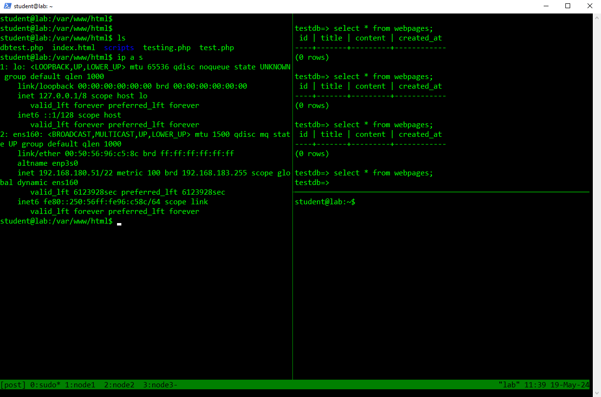

# **ICA006 - Andmesalvestustehnoloogiad**

## **Grupi number 3 ülesanne:**
Kasutades ILO haldusliidest seadistada laboris riistvara peale RAID grupp operatsioonisüsteemi jaoks, installida endale sobiv serveri operatsioonisüsteem (3 serverit)

Serveritele paigaldada horisontaalselt skaleeruv tarkvara (CEPH, ScaleIO, Microsoft Storagespaces, MinIO, Lustre, LizardFS jms)

Provisioneerida andmesalvestus pind eraldi virtuaalserverile (kas plokina, jagatud failisüsteemina või objektide salvestuskohana). Et muuta ülesanne realistlikumaks, võiks seda pinda kasutada kas andmebaas või mingi veebirakendus.

Dokumenteerida protsess Teams'is või WiKi's. Dokumenteerimisel võiks mõelda selle peale, et kuidas spetsialistina sooviksid võtta enda haldusesse süsteemi. 

## Sisukord

1. [Ressursid](#ressursid)
2. [Ülevaade](#ülevaade)
3. [RAID](#1-raid)
4. [Ubuntu Install](#2-ubuntu-install)
   - [2.1 Ubuntu ISO](#21-ubuntu-iso)
5. [Serverite Ettevalmistus](#3-serverite-ettevalmistus)
   - [3.1 Post-Installation](#31-post-installation)
6. [Klastri Seadistamine](#4-klastri-seadistamine)
   - [4.1 Primary Server](#41-primary-server)
   - [4.2 Standby Server 1](#42-standby-server-1)
   - [4.3 Standby Server 2](#43-standby-server-2)
   - [Repmgrd](#repmgrd)
7. [Keepalived Seadistamine](#5-keepalived-seadistamine)
8. [Apache2 Seadistamine](#6-apache2-seadistamine)
9. [Kasutatud allikad](#7-kasutatud-allikad)

## **Ressursid**
| Ilo             | Serverid              | Virtukas       |      VIP        |
|-----------------|-----------------------|----------------|-----------------|
| 192.168.161.107 | 192.168.161.117/node1 | 192.168.180.51 | 192.168.161.89  |
| 192.168.161.108 | 192.168.161.118/node2 |                |                 |
| 192.168.161.109 | 192.168.161.119/node3 |                |                 |

## **Ülevaade**
Serveritele operatsioonisüsteemideks valisime Ubuntu 22.04 (Jammy Jellfish).
Andmesalvestuspinna loomiseks kasutame Postgresqli ning kõrgkäaideldavuse jaoks kasutame extensionit nimega RepMgr (Replication Manager), millega on väga tõhus kõrgkäideldavat lahendust luua.

# **1. RAID**

RAIDI konfigureerimiseks tuleb booti ajal vajutada nuppu F8. Eduka soorituse korral avaneb järgnev menüü:


Kuna ülesande põhimõte on kõrgkäideldavus ehk saavutada maksimaalne uptime, siis otsustasime panna kaks ketas RAID 1+0, millest sai meie boot drive. Konfiguratsioon on nähtav all oleval pildil:


# **2. Ubuntu Install**

## **2.1 Ubuntu iso**
Iso lisamiseks serverile, tuleb esmalt valida konsooli üleval olevast menüüst **Virtual Drives** - **Image File CD-ROM/DVD** ning vali vastav fail. Seejärel rebootida.

**Ubuntu endi installatsiooni protsessi ei dokumenteeri**

# **3. Serverite Ettevalmistus**
Serverite tõhusamaks haldamiseks kasutamise Tmuxi, kus meile antud virtukas täitis jump-serveri rolli.


## **3.1 Post Installation**
Esimese sammuna tegime igale masinale uuendused, tagamaks **Up to date** olekud:
```bash
sudo apt update && sudo apt upgrade
```

Teise sammuna tuleb installida **postgresql**, **repmgr** ja **keepalived**:
```bash
sudo apt install postgresql
sudo apt install repmgr
sudo apt install keepalived
```

**Veenduda installatisooni edukuses ja ka versioonides**:
```bash
psql --verison
repmgr --version
keepalived --version
```

# **4. Klastri seadistamine**
## **4.1 Primary server**
```bash
# Seaedistamiseks kasutada postgres userit
sudo -i -u  postgres

# postgresql.conf faili muutmine
cat <<EOF >> /etc/postgresql/14/main/postgresql.conf
listen_address = '*'
max_wal_senders = 10
max_replication_slots = 10
wal_level = 'replica'
hot_standby = on
archive_mode = on
archive_command = '/bin/true'
EOF

# Alustada postgresql server
sudo systemctl start postgresql.service

# Luua kasutaja repmgr ning ka andmebaas nimega repmgr
createuser -s repmgr
createdb repmgr -O repmgr

#Luua kasutaja testuser ning ka andmebaas nimega testdb
psql
CREATE USER testuser WITH PASSWORD '1234';
CREATE DATABASE testdb;
GRANT ALL PRIVILEGES ON DATABASE testdb TO testuser;

# pg_hba.conf faili muutmine
host    replication     repmgr          192.168.161.0/24            scram-sha-256
host    repmgr          repmgr          192.168.161.0/24            scram-sha-256
host    testdb          testuser        192.168.180.0/22            md5

# Luua fail repmgr.conf /etc/ folderisse. Seda tuleb teha admin kontoga.
su admin-tuule

sudo vim /etc/repmgr.conf

node_id=1
node_name=node1
conninfo='host=192.168.161.117 user=repmgr dbname=repmgr connect_timeout=2'
data_directory='/var/lib/postgresql/14/main'
failover=automatic
promote_command='repmgr -f /etc/repmgr.conf standby promote'
follow_command='repmgr -f /etc/repmgr.conf stamdby follow'

# registreerida primary server klastrisse
sudo -i -u postgres

repmgr -f /etc/repmgr.conf primary register

# oodatav output:
INFO: connecting to primary database...
NOTICE: attempting to install extension "repmgr"
NOTICE: "repmgr" extension successfully installed
NOTICE: primary node record (ID: 1) registered

# teha kindlaks klastri olemasolu ning primary nodei eksistents:
repmgr cluster show --compact

 ID | Name  | Role    | Status    | Upstream | Location | Prio. | TLI
----+-------+---------+-----------+----------+----------+-------+-----
 1  | node1 | primary | * running |          | default  | 100   | 1
```
## **4.2 Standby server 1**
```bash
# Seaedistamiseks kasutada postgres userit
sudo -i -u postgres

# veenduda, et standby serveri kaudu on võimalik ühendust luua primary serveriga.
psql -h 192.168.161.117 -U repmgr -d repmgr

# postgresql.conf faili muutmine
cat <<EOF >> /etc/postgresql/14/main/postgresql.conf
listen_address = '*'
max_wal_senders = 10
max_replication_slots = 10
wal_level = 'replica'
hot_standby = on
archive_mode = on
archive_command = '/bin/true'
EOF

# Alustada postgresql server
sudo systemctl start postgresql.service

# pg_hba.conf faili muutmine
host    replication     repmgr          192.168.161.0/24            scram-sha-256
host    repmgr          repmgr          192.168.161.0/24            scram-sha-256
host    testdb          testuser        192.168.180.0/22            md5

# Luua fail repmgr.conf /etc/ folderisse. Seda tuleb teha admin kontoga.
su admin-tuule

sudo vim /etc/repmgr.conf

node_id=2
node_name=node2
conninfo='host=192.168.161.118 user=repmgr dbname=repmgr connect_timeout=2'
data_directory='/var/lib/postgresql/14/main'
failover=automatic
promote_command='repmgr -f /etc/repmgr.conf standby promote'
follow_command='repmgr -f /etc/repmgr.conf stamdby follow'

# registreerida primary server klastrisse
sudo -i -u postgres

# primary serverist kloonimine
repmgr -h 192.168.161.117 -U repmgr -d repmgr -f repmgr.conf standby clone

# Alustada postgresql server
sudo systemctl start postgresql.service

repmgr -f /etc/repmgr.conf primary register

# teha kindlaks klastri olemasolu ning esimese standby nodei eksistents:
repmgr cluster show --compact
 ID | Name  | Role    | Status    | Upstream | Location | Prio. | TLI
----+-------+---------+-----------+----------+----------+-------+-----
 1  | node1 | primary | * running |          | default  | 100   | 1
 2  | node2 | standby |   running | node1    | default  | 100   | 1
```

## **4.3 Standby server 2**
```bash
# Seaedistamiseks kasutada postgres userit
sudo -i -u postgres

# veenduda, et standby serveri kaudu on võimalik ühendust luua primary serveriga.
psql -h 192.168.161.117 -U repmgr -d repmgr

# postgresql.conf faili muutmine
cat <<EOF >> /etc/postgresql/14/main/postgresql.conf
listen_address = '*'
max_wal_senders = 10
max_replication_slots = 10
wal_level = 'replica'
hot_standby = on
archive_mode = on
archive_command = '/bin/true'
EOF

# Alustada postgresql server
sudo systemctl start postgresql.service

# pg_hba.conf faili muutmine
host    replication     repmgr          192.168.161.0/24            scram-sha-256
host    repmgr          repmgr          192.168.161.0/24            scram-sha-256
host    testdb          testuser        192.168.180.0/22            md5

# Luua fail repmgr.conf /etc/ folderisse. Seda tuleb teha admin kontoga.
su admin-tuule

sudo vim /etc/repmgr.conf

node_id=3
node_name=node3
conninfo='host=192.168.161.119 user=repmgr dbname=repmgr connect_timeout=2'
data_directory='/var/lib/postgresql/14/main'
failover=automatic
promote_command='repmgr -f /etc/repmgr.conf standby promote'
follow_command='repmgr -f /etc/repmgr.conf stamdby follow'

# registreerida primary server klastrisse
sudo -i -u postgres

# primary serverist kloonimine
repmgr -h 192.168.161.117 -U repmgr -d repmgr -f repmgr.conf standby clone

# Alustada postgresql server
sudo systemctl start postgresql.service

repmgr -f /etc/repmgr.conf primary register

# teha kindlaks klastri olemasolu ning esimese standby nodei eksistents:
repmgr cluster show --compact

 ID | Name  | Role    | Status    | Upstream | Location | Prio. | TLI
----+-------+---------+-----------+----------+----------+-------+-----
 1  | node1 | primary | * running |          | default  | 100   | 1
 2  | node2 | standby |   running | node1    | default  | 100   | 1
 3  | node3 | standby |   running | node1    | default  | 100   | 1
```
## **Repmgrd**
Igal nodeil tuleb käima panna ka repmgrd, tänu sellele on meil võimalik saavutada automaatne failover ja monitoorimine.

```bash
# tehes seda postgres kasutajaga igal masinal
repmgrd -f /etc/repmgr.conf

# veenduda, et repmgrd töötab igal masinal:
repmgr service status
 ID | Name  | Role    | Status    | Upstream | repmgrd | PID   | Paused? | Upstream last seen                                           ----+-------+---------+-----------+----------+---------+-------+---------+--------------------                                           1  | node1 | primary | * running |          | running | 11730 | no      | n/a                                                           2  | node2 | standby |   running | node1    | running | 8724  | no      | 0 second(s) ago                                               3  | node3 | standby |   running | node1    | running | 8943  | no      | 0 second(s) ago  
```
# **5. Keepalived seadistamine**
Keepalived täidab meie lahenduses väga tähtsat rolli - VIP (Virtual IP).
VIP-ga saame siduda kõik kolm klastris olevat nodei ühe ip alla. Olukorras, kus primary õlg maha kukub ning standbyst saab uus primary, jääb ip ikkagist samaks tänu VIP-le.

```bash
# Primary server
vrrp_instance VI_1 {
    state MASTER
    interface enp3s0f0
    virtual_router_id 51
    priority 150
    advert_int 1

    authentication {
        auth_type PASS
        auth_pass secret
    }

    virtual_ipaddress {
        192.168.161.89
    }
}

# Standby server 1
vrrp_instance VI_1 {
    state MASTER
    interface enp3s0f0
    virtual_router_id 51
    priority 100
    advert_int 1

    authentication {
        auth_type PASS
        auth_pass secret
    }

    virtual_ipaddress {
        192.168.161.89
    }
}

# Standby server 2
vrrp_instance VI_1 {
    state MASTER
    interface enp3s0f0
    virtual_router_id 51
    priority 50
    advert_int 1

    authentication {
        auth_type PASS
        auth_pass secret
    }

    virtual_ipaddress {
        192.168.161.89
    }
}

# veenudme VIP-i olemasolus
ip a s | grep -A 3 enp3s0f0

2: enp3s0f0: <BROADCAST,MULTICAST,UP,LOWER_UP> mtu 1500 qdisc mq state UP group default qlen 1000                                           inet 192.168.161.118/24 brd 192.168.161.255 scope global enp3s0f0                                                                       inet 192.168.161.89/32 scope global enp3s0f0 
```

# **6. Apache2 seadistamine**
```bash
sudo apt install apache2 php-pgsql postgresql

# insert.php ja display.php loomine
mkdir /var/www/html/scripts
cd /var/www/html/scripts

# andmebaasi ja tabelite loomine
sudo -i -u postgres
psql -h 192.168.161.117 -U testuser -d testdb

CREATE TABLE webpages (
    id SERIAL PRIMARY KEY,
    title VARCHAR(255) NOT NULL,
    content TEXT NOT NULL,
    created_at TIMESTAMP DEFAULT CURRENT_TIMESTAMP
);

# insert.php
<?php
$host = '192.168.161.89';
$db = 'testdb';
$user = 'testuser';
$pass = '1234';
$port = '5432';

// Establish connection
$conn = pg_connect("host=$host dbname=$db user=$user password=$pass port=$port");

if (!$conn) {
    die("Connection failed: " . pg_last_error());
} else {
    echo "Connection successful.<br>";
}

// Insert webpage content
$title = 'Home Page';
$content = '<h1>Welcome to My Website</h1><p>This is the home page content.</p>';

$query = "INSERT INTO webpages (title, content) VALUES ($1, $2)";
$result = pg_query_params($conn, $query, array($title, $content));

if (!$result) {
    echo "An error occurred while inserting data: " . pg_last_error($conn) . "<br>";
} else {
    echo "Data inserted successfully.<br>";
}

pg_close($conn);
?>

# display.php
<?php
$host = '192.168.161.89';
$db = 'testdb';
$user = 'testuser';
$pass = '1234';
$port = '5432';

// Establish connection
$conn = pg_connect("host=$host dbname=$db user=$user password=$pass port=$port");

if (!$conn) {
    die("Connection failed: " . pg_last_error());
}

// Fetch webpage content by title
$title = 'Home Page';
$query = "SELECT content FROM webpages WHERE title = $1";
$result = pg_query_params($conn, $query, array($title));

if (!$result) {
    echo "An error occurred while querying data.\n";
    exit;
}

$row = pg_fetch_assoc($result);
$content = $row['content'];

// Display the content
echo $content;

pg_close($conn);
?>
```

# **7. Kasutatud allikad**
https://www.repmgr.org/docs/5.3/index.html